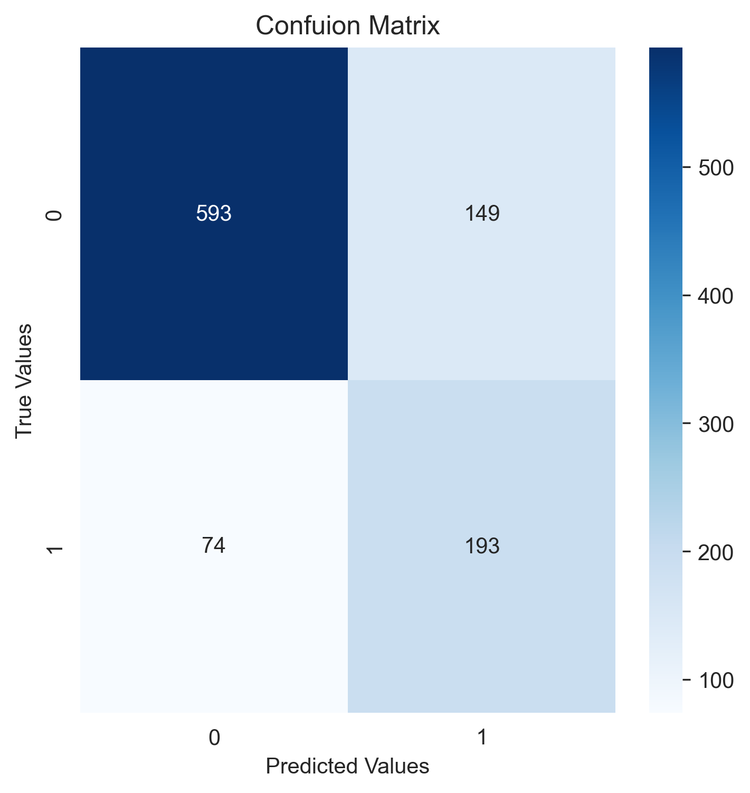

# Telecom Churn Prediction

This project focuses on predicting customer churn in a telecom company using a Random Forest classifier. The goal is to identify customers who are likely to cancel their service, allowing the company to take proactive measures to retain them.

## Table of Contents
- [Overview](#overview)
- [Dataset](#dataset)
- [Installation](#installation)
- [Project Structure](#project-structure)
- [Data Preprocessing](#data-preprocessing)
- [Model Training](#model-training)
- [Evaluation](#evaluation)
- [Results](#results)
- [Contributing](#contributing)
- [License](#license)

## Overview

Customer churn is a significant issue in the telecom industry, where customers frequently switch service providers. Predicting churn can help telecom companies identify high-risk customers and develop strategies to improve customer retention. In this project, a Random Forest classifier is used to predict churn based on various customer features.

## Dataset

The dataset used in this project includes customer information such as:
- Customer demographics 
- Subscription details 
- Account Details
- Contract details

The dataset can be obtained from Kaggle. It typically contains features and a target variable (`Churn`) indicating whether the customer has churned.

## Installation

To run this project locally, follow these steps:

1. Clone the repository:
   git clone https://github.com/charans2702/Telecom_Churn_Prediction.git
   cd telecom-churn-prediction
2. Install the required packages:
   pip install -r requirements.txt
   
## Project Structure

- `images/`: Contains images used in the project
- `templates/`: Contains HTML code for Flask app
  - `index.html`: Main HTML template for the web interface
- `Churn_prediction_model.ipynb`: Jupyter notebook for model development and evaluation
- `Exploratory_Data_Analysis.ipynb`: Jupyter notebook for initial data exploration
- `app.py`: Main application file for deploying the model (Flask app)
- `Cleaned_data.csv.txt`: Cleaned and processed dataset
- `model.pkl`: Serialized model file
- `requirements.txt`: The list of required Python packages
- `telco_churn.csv`: Original dataset file
- `README.md`: The top-level README for developers using this project

## Data Preprocessing

The data preprocessing steps include:
1. Handling missing values.
2. Encoding categorical variables using techniques such as One-Hot Encoding.
3. Scaling numerical features.
4. Splitting the data into training and testing sets.

These steps are performed in the `data_preprocessing.py` script or the corresponding Jupyter notebook.

## Model Training

The Random Forest classifier is trained on the preprocessed data. The training process involves:
1. Splitting the data into training and testing sets.
2. Initializing the Random Forest classifier with suitable hyperparameters.
3. Training the model on the training set.
4. Evaluating the model on the testing set.

## Evaluation

The model's performance is evaluated using various metrics, including:
- Accuracy
- Precision
- Recall
- F1 Score
- Confusion Matrix
- ROC-AUC Curve

The evaluation results are saved in the `results/` directory.

## Results

The Random Forest model achieved the following performance on the test set:
- **Accuracy**: `77.89%`
- **Precision**: `0.89`
- **Recall**: `0.80`
- **F1 Score**: `0.84`
- **ROC-AUC**: `0.85`
- **CONFUSION MATRIX**:
                    
- **ROC_CURVE**:
                    

These results demonstrate the model's effectiveness in predicting telecom churn.

## Contributing

Contributions are welcome! Please feel free to submit a Pull Request or open an Issue.

## License

This project is licensed under the MIT License - see the LICENSE file for details.
